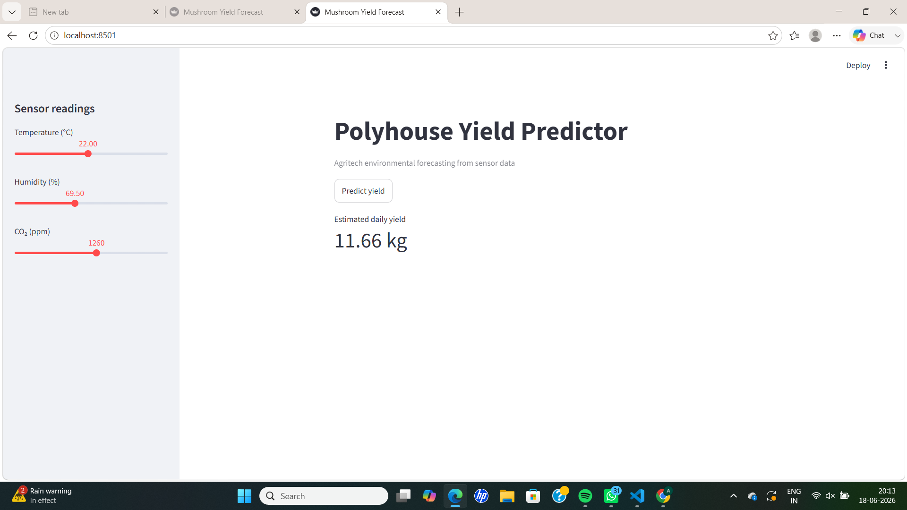

## Supporting Artifacts

- reports/cleaning_log.md
- reports/data_quality.md
- reports/eda_summary.md
- reports/cv_results.md
- reports/model_comparison_summary.md
- reports/tuning_rationale.md
- reports/test_scenarios.md

### Streamlit Application
## 7. Streamlit Application & Deployment

Deployment URL:

https://zelbytes-yier2yrtozdt2dwauieuukc.streamlit.app

The application was deployed on Streamlit Community Cloud and provides real-time mushroom yield predictions using temperature, humidity, and CO₂ sensor readings.

